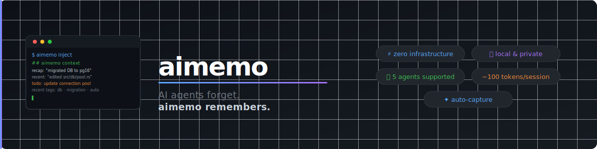

<p align="center">
  
</p>

<h1 align="center">memo — Persistent memory for AI coding agents</h1>

<p align="center">
  Give Claude Code, Cursor, Windsurf, and GitHub Copilot a memory that survives across sessions.<br/>
  One command to set up. Zero manual steps. Works in any project.
</p>

<p align="center">
  <a href="https://github.com/rustkit-ai/memo/actions/workflows/ci.yml"></a>
  <a href="https://crates.io/crates/memo-agent"></a>
  <a href="LICENSE"></a>
</p>

---

**Every AI session starts from scratch.** The agent re-reads files it already read, re-discovers conventions it already learned, asks questions it already asked. On a large codebase this wastes hundreds of tokens and minutes of context-building — every single time.

`memo` fixes this with a compact context block (~80 tokens) injected at session start. The agent writes it. The agent reads it. You just work.

```
$ memo inject

## memo context
last: 2026-03-15 — "refactored auth middleware, JWT now stateless"
todo: fix token refresh in utils.rs:42
recent tags: refactor · auth · bug
```

---

## Supported agents

| Agent | Auto-inject | Context file |
|---|---|---|
| **Claude Code** | Yes — Stop hook runs automatically at session end | `CLAUDE.md` |
| **Cursor** | Agent-triggered at session start | `.cursor/rules/memo.mdc` |
| **Windsurf** | Agent-triggered at session start | `.windsurfrules` |
| **GitHub Copilot** | Agent-triggered at session start | `.github/copilot-instructions.md` |

---

## Install

**cargo**:
```sh
cargo install memo-agent
```

**curl** (Linux / macOS):
```sh
curl -fsSL https://github.com/rustkit-ai/memo/releases/latest/download/install.sh | sh
```

**brew**:
```sh
brew tap rustkit-ai/memo https://github.com/rustkit-ai/memo
brew install memo
```

---

## Setup — one command, all agents

Run this once in your project root:

```sh
memo setup
```

`memo setup` configures every supported agent at once:

- **Claude Code** — writes instructions into `CLAUDE.md` and installs a Stop hook in `.claude/settings.json` so context refreshes automatically when you close a session
- **Cursor** — writes `.cursor/rules/memo.mdc` with `alwaysApply: true`
- **Windsurf** — writes `.windsurfrules`
- **GitHub Copilot** — writes `.github/copilot-instructions.md`

You never have to think about it again.

---

## How it works

### 1. Work normally

Your agent logs what it does using `memo log` as it goes:

```
You: implement the password reset flow

Agent: [works on the feature]
       memo log "implemented password reset: email token, 1h expiry, bcrypt hash"
       memo log "todo: add rate limiting on /reset endpoint"
```

### 2. Session ends — context updates automatically

**Claude Code**: the Stop hook fires and runs `memo inject --claude`. `CLAUDE.md` is updated silently in the background.

**Cursor / Windsurf / Copilot**: at the start of the next session, the agent runs its inject command before doing anything else.

The context block written to your rules file:

```markdown
<!-- memo:start -->
## memo context
last: 2026-03-15 — "implemented password reset: email token, 1h expiry, bcrypt hash"
todo: add rate limiting on /reset endpoint
recent tags: auth · security · todo
<!-- memo:end -->
```

### 3. Next session — the agent knows where it left off

```
You: what did we do last time?

Agent: Based on memo — you implemented password reset with an email token,
       1h expiry, and bcrypt hash. Still need to add rate limiting on /reset.
       Want me to start there?
```

No re-exploration. No repeated questions. Every session picks up exactly where the last one ended.

---

## The full loop

```
┌─────────────────────────────────────────────────────────────┐
│                                                             │
│   memo setup              ← run once, configures all       │
│        │                    agents automatically           │
│        ▼                                                   │
│   Open Claude Code / Cursor / Windsurf / Copilot           │
│        │                                                   │
│        ▼                                                   │
│   Agent reads context file  ←── memory from last session   │
│        │                                                   │
│        ▼                                                   │
│   Work: tasks, fixes, features                             │
│        │                                                   │
│        ▼                                                   │
│   Agent logs with memo log "..."                           │
│        │                                                   │
│        ▼                                                   │
│   Session ends → context file updated ─────────────────┐  │
│                                                         │  │
│   Next session ◄────────────────────────────────────────┘  │
│                                                             │
└─────────────────────────────────────────────────────────────┘
```

---

## Agent guides

Step-by-step integration guide for each agent:

- [Claude Code — automatic memory via Stop hook](docs/agents/claude-code.md)
- [Cursor — persistent context with alwaysApply rules](docs/agents/cursor.md)
- [Windsurf — session memory via .windsurfrules](docs/agents/windsurf.md)
- [GitHub Copilot — persistent instructions across sessions](docs/agents/copilot.md)

---

## Commands

| Command | Description |
|---|---|
| `memo setup` | One-time setup for all agents |
| `memo init` | Initialize project memory |
| `memo log "<message>"` | Save a memory entry |
| `memo log "<message>" --tag refactor` | Save with a tag |
| `memo log -` | Read message from stdin |
| `memo inject` | Print context block to stdout |
| `memo inject --claude` | Write context into `CLAUDE.md` |
| `memo inject --cursor` | Write context into `.cursor/rules/memo.mdc` |
| `memo inject --windsurf` | Write context into `.windsurfrules` |
| `memo inject --copilot` | Write context into `.github/copilot-instructions.md` |
| `memo inject --since 7d` | Limit context to last 7 days |
| `memo inject --format json` | JSON output for programmatic use |
| `memo list` | Show last 10 entries |
| `memo list --all` | Show all entries |
| `memo list --tag bug` | Filter by tag |
| `memo search <query>` | Full-text search across all entries |
| `memo delete <id>` | Delete a specific entry |
| `memo tags` | List all tags with usage counts |
| `memo stats` | Entry count and token savings estimate |
| `memo clear` | Clear all memory for current project |

---

## Why not just edit the rules files manually?

You can — but then **you** do the work. `memo` lets the agent maintain its own memory, automatically, without any human intervention between sessions. The agent writes. The agent reads. You just focus on your code.

---

## License

MIT — [rustkit-ai/memo](https://github.com/rustkit-ai/memo)
